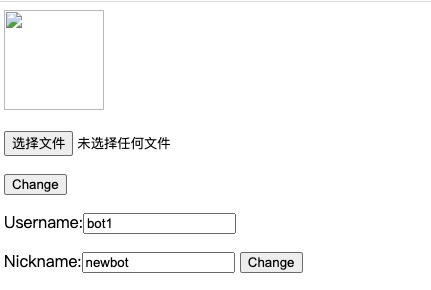

# 用户管理系统

## 功能需求

实现一个用户管理系统，用户可以登录、拉取和编辑他们的profiles。 

用户可以通过在Web页面输入username和password登录，backend系统负责校验用户身份。

成功登录后，页面需要展示用户的相关信息；否则页面展示相关错误。

成功登录后，用户可以编辑以下内容：

1. 上传profile picture

2. 修改nickname（需要支持Unicode字符集，utf-8编码）

用户信息包括：

1. username（不可更改）

2. nickname

3. profile picture

需要提前将初始用户数据插入数据库用于测试。确保测试数据库中包含10,000,000条用户账号信息。

## 设计要求

* 分别实现HTTP server和TCP server，主要的功能逻辑放在TCP server实现
* Backend鉴权逻辑需要在TCP server实现
* 用户账号信息必须存储在MySQL数据库。通过MySQL Go client连接数据库
* 使用基于Auth/Session Token的鉴权机制，Token存储在redis，避免使用JWT等加密的形式。
* TCP server需要提供RPC API，RPC机制希望自己设计实现
* Web server不允许直连MySQL、Redis。所有HTTP请求只处理API和用户输入，具体的功能逻辑和数据库操作，需要通过RPC请求TCP server完成
* 尽可能使用Go标准库
* 安全性
* 鲁棒性
* 性能

## 开发环境

* 操作系统：macOS Catalina 10.15.6
* Go:1.15.6
* Mysql: 8.0.22
* Redis: 6.0.10

## 设计简介

* 此项目主要包含三个部分

  * 用户登陆界面
  * http server的服务
  * tcp server的服务

  Note:主要是http erver和tcp server模块，其中最重要的是tcp server。

* **HTTP Server**负责处理HTTP请求，对用户数据进行简单处理并转发至TCP服务。

* **TCP Server**处理HTTP服务转发的请求并访问MySQL和redis。

* http server和tcp server 之间的通信主要是通过rpc协议。

* **rpc**通信协议实现。

  * rpc客户端：通过tcp 连接rpc服务器，发送不同的数据信息，从而调用不同的rpc服务。
  * rpc服务端：首先注册一些服务(本质服务对应的服务处理函数), 监听请求。 当收到rpc客户端数据时，解析信息调用对应的服务并且将处理完成的结果返回给客户端。

  

## 实现流程

**整体流程图**


**具体登陆获取信息请求**


## API接口

### 1.注册接口信息

| URL                          | 方法 |
| ---------------------------- | ---- |
| http://localhost:1088/signUp | POST |

**输入参数**

| 参数名   | 描述   | 可选 |
| -------- | ------ | ---- |
| username | 用户名 | 否   |
| password | 密码   | 否   |
| nickname | 昵称   | 是   |


### 2.登录接口信息

| URL                         | 方法 |
| --------------------------- | ---- |
| http://localhost:1088/login | POST |

**输入参数**

| 参数名   | 描述   | 可选 |
| -------- | ------ | ---- |
| username | 用户名 | 否   |
| password | 密码   | 否   |

### 3.获取用户信息接口信息

>需要在登录接口之后调用

| URL                           | 方法 |
| ----------------------------- | ---- |
| http://localhost:1088/profile | GET  |

**输入参数**

| 参数名   | 描述   | 可选 |
| -------- | ------ | ---- |
| username | 用户名 | 否   |

### 4.更改用户昵称接口信息

> 需要在登录接口之后调用

| URL                                  | 方法 |
| ------------------------------------ | ---- |
| http://localhost:1088/updateNickName | POST |

**输入参数**

| 参数名   | 描述   | 可选 |
| -------- | ------ | ---- |
| username | 用户名 | 否   |
| nickname | 新昵称 | 否   |

### 5.更改用户头像接口信息

> 需要在登录接口之后调用

| URL                                    | 方法 |
| -------------------------------------- | ---- |
| http://localhost:1088/uploadProfilePic | POST |

**输入参数**

| 参数名   | 描述         | 可选 |
| -------- | ------------ | ---- |
| username | 用户名       | 否   |
| image    | 头像图片路径 | 否   |

## 数据储存

### mysql设计

主要维护两张表，一张保存用户信息， 一张保存用户登陆信息。

更详细可以参考**mysql/usermane.sql**文件创建表格sql语句

#### 用户信息表

| Field     | Field        | Null | Key  | Default | Extra          |
| --------- | ------------ | ---- | ---- | ------- | -------------- |
| id        | bigint       | NO   | PRI  | NULL    | auto_increment |
| user_name | varchar(255) | NO   | UNI  |         |                |
| nick_name | varchar(255) | NO   |      |         |                |
| pic_name  | varchar(255) | YES  |      |         |                |

note: **pic_name**字段主要用于存储用户头像的路径。

#### 用户登陆信息表

| Field     | Field        | Null | Key  | Default | Extra          |
| --------- | ------------ | ---- | ---- | ------- | -------------- |
| id        | bigint       | NO   | PRI  | NULL    | auto_increment |
| user_name | varchar(255) | NO   | UNI  |         |                |
| password  | varchar(255) | NO   |      |         |                |

### redis设计

redis缓存数据设计。

主要是缓冲登陆校验的token和用户信息，其中用户信息键值对中的值，是一个哈希表，表中有三项元素，分表是代表用户信息是否有效，用的的nick_name, 用户的pic_name。

| key           | value                                          |
| ------------- | ---------------------------------------------- |
| auto_username | Token                                          |
| username      | { [valid, 1/""],[nick_name, “”] [pic_name,“”]} |

## 代码结构

```
usermana
├── README.md              	//程序文档
├── benchmark								//压力测试文件
├── config                  //配置文件
├── httpServer							//http server
├── log											//日志相关文件	
├── mysql										//mysql
├── protocol								//主要定义一些通讯的数据结构
├── redis										//redis相关文件
├── resource								//文档所需要资源
├── rpc											//rpc实现
├── static									//用户头像存放路径
├── tcpServer								//tcp server
├── templates								//用户UI相关html
└── utils										//相关辅助函数

```

## 部署

1. 在conf/bench_conf配置系统资源
2. 在redis/config.go配置redis和mysql
3. 运行TCP server

```bash
cd tcpServer
go vet
go build tcpServer.go
./tcpServer
```

4. 运行HTTP server

```bash
cd httpServer
go vet
go build httpServer.go
./httpServer
```


## 功能测试

**用户登陆**


**用户登陆成功**


**显示用户信息**

> 默认用户图像信息为空



**修改用户头像路径**


## 单元测试

简单对redis,mysql,tcpserver接口进行单元测试.

分别在**redis, mysql, tcpServer**，目录下执行

```bash
go test
```

主要执行**redis/redis_test.go**，**mysql/mysql_test.go**,**tcpServer/tcpServer_test.go**测试文件.

## 压力测试

### 模拟

使用程序模拟多用户并发请求，一个协程(goroutine)对应一个用户，并发启动多个协程，即可达到模拟测试目的。

运行**benchmark/benchmark.go**文件，即可模拟压力测试。

### login:

#### 固定用户 200 并发

> Total Requests(5000) - Concurrency(200) - Random(false) - Cost(142.563168ms) - QPS(35073/sec)

#### 随机用户 200 并发

> Total Requests(5000) - Concurrency(200) - Random(true) - Cost(136.893744ms) - QPS(36525/sec)

#### 固定用户 2000 并发

> Total Requests(5000) - Concurrency(2000) - Random(false) - Cost(391.947248ms) - QPS(12757/sec)

#### 随机用户 2000 并发

> Total Requests(5000) - Concurrency(2000) - Random(true) - Cost(420.174593ms) - QPS(11900/sec)

### profile:

#### 固定用户 200 并发

> Total Requests(5000) - Concurrency(200) - Random(false) - Cost(133.75811ms) - QPS(37381/sec)

#### 随机用户 200 并发

> Total Requests(5000) - Concurrency(200) - Random(true) - Cost(130.668901ms) - QPS(38265/sec)

#### 固定用户 2000 并发

> Total Requests(5000) - Concurrency(2000) - Random(false) - Cost(383.837833ms) - QPS(13027/sec)

#### 随机用户 2000 并发

> Total Requests(5000) - Concurrency(2000) - Random(true) - Cost(404.677492ms) - QPS(12356/sec)

### updateNickName:

#### 固定用户 200 并发

> Total Requests(5000) - Concurrency(200) - Random(false) - Cost(140.719206ms) - QPS(35532/sec)

#### 随机用户 200 并发

> Total Requests(5000) - Concurrency(200) - Random(true) - Cost(151.213109ms) - QPS(33066/sec)

#### 固定用户 2000 并发

> Total Requests(5000) - Concurrency(2000) - Random(false) - Cost(376.417359ms) - QPS(13284/sec)

#### 随机用户 2000 并发

> Total Requests(5000) - Concurrency(2000) - Random(true) - Cost(424.903766ms) - QPS(11768/sec)

